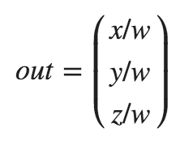
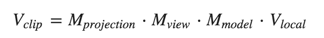
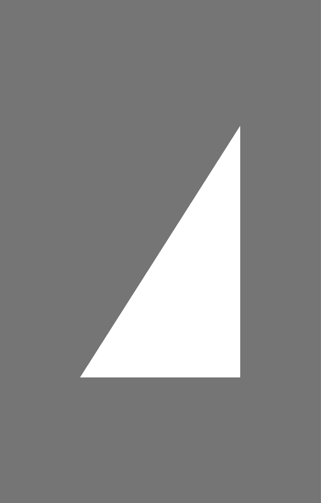
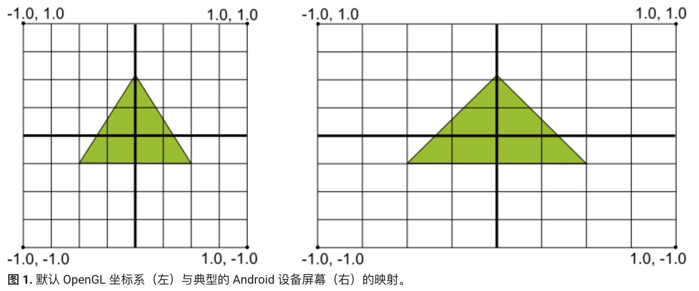
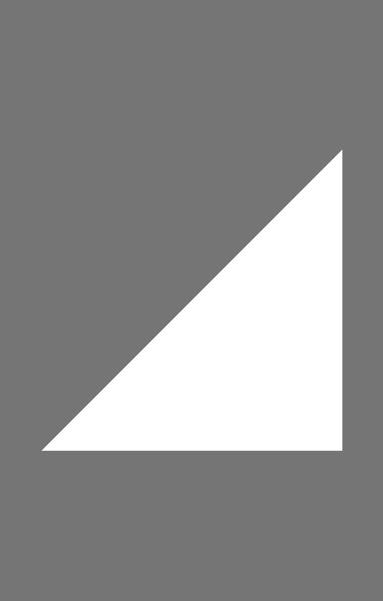

OpenGL需要通过一系列坐标变换，才能将我们设置的顶点坐标变换为屏幕上的二维坐标或像素。这些坐标变换操作将所有顶点转化为标准化设备坐标（Normalized Device Coordinate, NDC）。也就是每个顶点的x/y/z坐标都将在-1.0 ~ 1.0之间，超过这个范围将不可见。


### 坐标系统及变化过程


主要关注的是5个坐标系统和3个变换矩阵。中文翻译可以不必追究，权威的书和网站，中文翻译结果都不一样，主要关注英文名称就好。

5个坐标系统：

* Model Space：模型空间，即图中Local Space
* World Space：世界空间
* View Space：观察空间
* Clip Space：裁剪空间
* Screen Space：屏幕空间

3个变换矩阵：

* Model Matrix：模型矩阵
* View Matrix：观察矩阵
* Projection Matrix：投影矩阵


​	重点提一下裁剪空间。在一个顶点着色器运行的最后，OpenGL期望所有的坐标都能落在一个特定的范围内，且任何在这个范围之外的点都应该被裁剪掉(Clipped)。被裁剪掉的坐标就会被忽略，所以剩下的坐标就将变为屏幕上可见的片段。这也就是裁剪空间(Clip Space)名字的由来。

​	由投影矩阵创建的**观察箱**(Viewing Box)被称为平截头体(Frustum)，每个出现在平截头体范围内的坐标都会最终出现在用户的屏幕上。将观察坐标变换为裁剪坐标的投影矩阵可以为两种不同的形式，每种形式都定义了不同的平截头体。我们可以选择创建一个正射投影矩阵(Orthographic Projection Matrix)或一个透视投影矩阵(Perspective Projection Matrix)。透视投影矩阵比较常用，讲下这个。

### 透视投影

如果你曾经体验过**实际生活**给你带来的景象，你就会注意到离你越远的东西看起来更小。这个奇怪的效果称之为透视(Perspective)。透视的效果在我们看一条无限长的高速公路或铁路时尤其明显，正如下面图片显示的那样：


正如你看到的那样，由于透视，这两条线在很远的地方看起来会相交。这正是透视投影想要模仿的效果，它是使用透视投影矩阵来完成的。这个投影矩阵将给定的平截头体范围映射到裁剪空间，除此之外还修改了每个顶点坐标的w值，从而使得离观察者越远的顶点坐标w分量越大。被变换到裁剪空间的坐标都会在-w到w的范围之间（任何大于这个范围的坐标都会被裁剪掉）。OpenGL要求所有可见的坐标都落在-1.0到1.0范围内，作为顶点着色器最后的输出，因此，一旦坐标在裁剪空间内之后，透视除法就会被应用到裁剪空间坐标上：



透视平截头体如下图所示：


任何在这个平截头体以外的东西最后都不会出现在裁剪空间体积内，并且将会受到裁剪。

### 矩阵组合

上述的每一个步骤都创建了一个变换矩阵：模型矩阵、观察矩阵和投影矩阵。一个顶点坐标将会根据以下过程被变换到裁剪坐标：



注意矩阵运算的顺序是相反的（记住我们需要从右往左阅读矩阵的乘法）。最后的顶点应该被赋值到顶点着色器中的gl_Position，OpenGL将会自动进行透视除法和裁剪。

### 右手坐标系

按照惯例，OpenGL是一个右手坐标系。简单来说，就是正x轴在你的右手边，正y轴朝上，而正z轴是朝向后方的。想象你的屏幕处于三个轴的中心，则正z轴穿过你的屏幕朝向你。坐标系画起来如下：


为了理解为什么被称为右手坐标系，按如下的步骤做：

- 沿着正y轴方向伸出你的右臂，手指着上方。
- 大拇指指向右方。
- 食指指向上方。
- 中指向下弯曲90度。

如果你的动作正确，那么你的大拇指指向正x轴方向，食指指向正y轴方向，中指指向正z轴方向。如果你用左臂来做这些动作，你会发现z轴的方向是相反的。这个叫做左手坐标系，它被DirectX广泛地使用。注意在标准化设备坐标系中OpenGL实际上使用的是左手坐标系（投影矩阵交换了左右手）。


### 屏幕尺寸适配

比如画个三角形，我们可以设置三角形三个顶点分别为：

```
static float triangleCoords[] = {
            0.5f,  0.5f, 0.0f, // top
            -0.5f, -0.5f, 0.0f, // bottom left
            0.5f, -0.5f, 0.0f  // bottom right
    };
```

其实根据三个顶点坐标我们可以看的出来，这应该是个等腰直角三角形。如果没有经过特殊处理（坐标系变换），直接在GLSurfaceView上画出来效果可能是下面这样：



会发现三角形两个腰并不相等。原因是GLSurfaceView的宽高并不相等，OpenGL坐标系向Android屏幕坐标系映射时宽高是分别映射的，屏幕(GLSurfaceView)宽高不同就导致了映射比例不一致的问题。



要解决这个问题就可以用开头提到的坐标系变换进行校正，这样，我们的图形对象在任何屏幕上都具有正确的比例。

一般使用下面代码解决屏幕宽高不一致导致映射后图形对象比例异常问题：

```
 @Override
    public void onSurfaceChanged(GL10 gl, int width, int height) {
        //计算屏幕(GLSurfaceView)宽高比
        float ratio=(float)width/height;

				//填充投影矩阵，将屏幕宽高比例作为平截头体的left和right，就可以校正屏幕宽高不一致问题
        Matrix.frustumM(mProjectMatrix, 0, -ratio, ratio, -1, 1, 3, 7);
        
        //创建观察矩阵
        val eye = floatArrayOf(0f, 0f, 3f)
        val center = floatArrayOf(0f, 0f, 0f)
        val up = floatArrayOf(0f, 1f, 0f)
        Matrix.setLookAtM(mViewMatrix, 0, eye[0], eye[1], eye[2],
                center[0], center[1], center[2], up[0], up[1], up[2])

        //计算最终的变换矩阵。因为矩阵运算顺序是相反的，所以mProjectMatrix作为left-hand-side matrix
        Matrix.multiplyMM(mMVPMatrix,0,mProjectMatrix,0,mViewMatrix,0);
    }

```

最后再把矩阵变换后的结果校正到每个顶点上即可。

```
private final String vertexShaderCode =
            "attribute vec4 vPosition;" +
                    "uniform mat4 vMatrix;"+
                    "void main() {" +
                    "  gl_Position = vMatrix*vPosition;" +
                    "}";

	@Override
    public void onDrawFrame(GL10 gl) {
        //将程序加入到OpenGLES2.0环境
        GLES20.glUseProgram(mProgram);
        //获取变换矩阵vMatrix成员句柄
        mMatrixHandler= GLES20.glGetUniformLocation(mProgram,"vMatrix");
        //指定vMatrix的值
        GLES20.glUniformMatrix4fv(mMatrixHandler,1,false,mMVPMatrix,0);
        //获取顶点着色器的vPosition成员句柄
        mPositionHandle = GLES20.glGetAttribLocation(mProgram, "vPosition");
        //启用三角形顶点的句柄
        GLES20.glEnableVertexAttribArray(mPositionHandle);
        //准备三角形的坐标数据
        GLES20.glVertexAttribPointer(mPositionHandle, COORDS_PER_VERTEX,
                GLES20.GL_FLOAT, false,
                vertexStride, vertexBuffer);
        //获取片元着色器的vColor成员的句柄
        mColorHandle = GLES20.glGetUniformLocation(mProgram, "vColor");
        //设置绘制三角形的颜色
        GLES20.glUniform4fv(mColorHandle, 1, color, 0);
        //绘制三角形
        GLES20.glDrawArrays(GLES20.GL_TRIANGLES, 0, vertexCount);
        //禁止顶点数组的句柄
        GLES20.glDisableVertexAttribArray(mPositionHandle);
    }
```

校正后就能得到等腰直角三角形：



对示例代码中的关键方法做个介绍：

##### Matrix.frustumM

```
Matrix.frustumM(float[] m, int offset, float left, float right, float bottom, float top, float near, float far)
```

* m：投影矩阵
* left：near面的left
* right：near面的right
* bottom：near面的bottom
* top：near面的top
* near：near面距离
* far：far面距离

该方法将会通过参数定义一个投影矩阵。near和far分别是平截头体(Frustum) 的两个面。left，right和bottom,top，这4个参数会影响图像左右和上下缩放比。left和right往往会分别设置为-ratio和ratio。top和bottom会影响上下缩放比，如果left和right已经设置好缩放，则bottom只需要设置为-1，top设置为1，这样就能保持图像不变形。

##### Matrix.setLookAtM

```
Matrix.setLookAtM(float[] rm, int rmOffset,
            float eyeX, float eyeY, float eyeZ,
            float centerX, float centerY, float centerZ, float upX, float upY,
            float upZ)
```

* rm：观察矩阵
* eyeX/Y/Z：相机位置，要保证相机位置在平头截体内部。比如平头截图near和far分别是3和7，如果相机eyeZ不在[3, 7]，屏幕中将看不到东西
* centerX/Y/Z：定义观察空间坐标原点，一般是（0, 0, 0）
* upX/Y/Z：定义相机的正方向。比如（0, 1, 0）和（0, 0, 1）得到的结果有90度旋转区别

该方法将会通过参数定义一个观察矩阵。


### 参考：

[learnopengl-坐标系统](https://learnopengl-cn.github.io/01 Getting started/08 Coordinate Systems/)

[learnopengl-摄像机](https://learnopengl-cn.github.io/01 Getting started/09 Camera/)