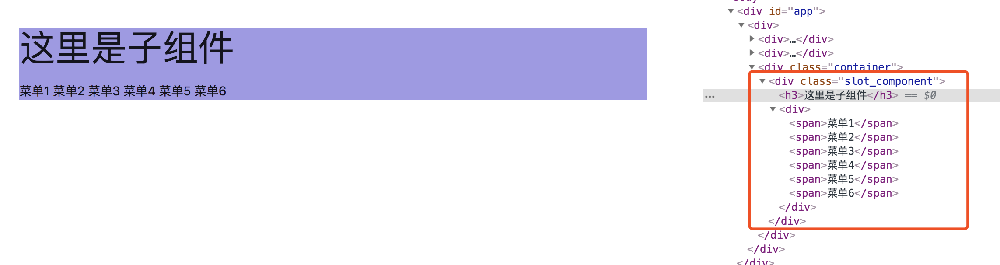

#Vue用法


### 1. Prop 用法


prop的思想是 props down, event up。

即父组件向子组件传递数据，子组件交互后事件回调给父组件，数据流是单向。

示例：

parent:

```
<template>
	      <!-- 
	      'component_name':子component的参数，通过prop机制父传递给子
	      'txt_sub_component':父component的参数，修改它就能修改子中的component_name
	      'btnComponentClicked'：子component发射的函数，即回调给父的方法
	      'eventFromChild': 父中的方法
	      -->
      
      <ButtonComponent 
	      v-bind:component_name="txt_sub_component" 
   		   v-on:btnComponentClicked="eventFromChild">init</ButtonComponent>

</template>

<script>
	method: {
		 eventFromChild: function() {
      		console.log("receive msg from child");
    	}
	}
</script>

```

child:

```
<template>
  <div class="component-button">
    <a class="waves-effect waves-light btn" 
    	v-on:click="onSubComponentClicked">{{ component_name }}</a>
  </div>
</template>

<script>
export default {
  props: ['component_name'],
  methods: {
    onSubComponentClicked: function() {
        // event up，btnComponentClicked是父组件中定义的响应函数
        this.$emit('btnComponentClicked')
    }
  }
}
</script>

```

### 2. Slot 插槽用法

插槽是组件的一段HTML模板。一个插槽显示什么东西由父组件控制，即HTML模板写在父组件中；显示的位置由子组件控制，即slot标签写在子组件中，写在子组件哪里，父组件中的模板就显示在哪里。

使用场景：我的理解是自定义组件中，不同使用场景需要对子组件有定制化需求，那么定制化的部分可以用slot实现。

示例：

parent:

```
<template>
   </div>
   		// 声明子组件
	 	<SlotComponent>
	 		// HTML模板代码，写在父组件中，子组件的slot会被渲染成下面这段模板
          <div >
              <span>菜单1</span>
              <span>菜单2</span>
              <span>菜单3</span>
              <span>菜单4</span>
              <span>菜单5</span>
              <span>菜单6</span>
            </div>
      	</SlotComponent>
    </div>
</template>
```

child: SlotComponent.vue

```
<template>
    <div class="slot_component">
        <h3>这里是子组件</h3>
        // 父组件中的HTML模板会替换slot，被渲染出来
        <slot></slot>
    </div>
</template>

<script>
export default {
    
}
</script>

<style>
.slot_component {
    background: #a098e7;
}
</style>
```

从渲染结果上可以看出来，子组件中的slot被替换为父组件中的HTML模板。



参考：

[深入理解vue中的slot与slot-scope](https://juejin.im/post/5a69ece0f265da3e5a5777ed)

