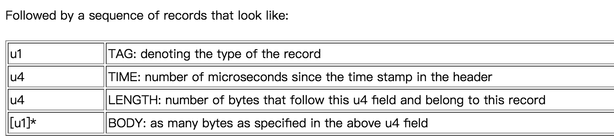

本文主要介绍Matrix的Resource部分，涉及Activity泄漏、Bitmap冗余对象的检测逻辑。

<!--more-->

再回顾下Matrix概览中提到的ResourceCanary模块的特点：基于 WeakReference 的特性和 [Square Haha](https://github.com/square/haha) 库开发的 Activity 泄漏和 Bitmap 重复创建检测工具。

主要特性如下：

- 分离了检测和分析部分，便于在不打断自动化测试的前提下持续输出分析后的检测结果
- 对检测部分生成的 Hprof 文件进行了裁剪，移除了大部分无用数据，降低了传输 Hprof 文件的开销
- 增加了重复 Bitmap 对象检测，方便通过减少冗余 Bitmap 数量，降低内存消耗


### 如何判断Activity发生泄漏

判断Activity是否泄漏需要确定两个问题：

* 如何在一个恰当的时机得知一个Activity已经结束了生命周期
* 如何判断一个Activity无法被GC机制回收

这部分内容，Matrix借鉴了[LeakCanary](https://github.com/square/leakcanary)的做法，对LeakCanary比较熟悉的同学可以跳过。


Demo中，`TestLeakActivity`被一个静态变量`testLeaks`持有：

```
public class TestLeakActivity extends Activity {
    private static Set<Activity> testLeaks = new HashSet<>();
    @Override
    protected void onCreate(@Nullable Bundle savedInstanceState) {
        super.onCreate(savedInstanceState);

        testLeaks.add(this);
	}
}
```

这就会导致退出页面时，`TestLeakActivity`无法正常销毁。通过操作demo，可以看到如下log：

```
V/Matrix.ActivityRefWatcher: triggering gc...
V/Matrix.ActivityRefWatcher: gc was triggered.
I/Matrix.ActivityRefWatcher: activity with key [MATRIX_RESCANARY_REFKEY_sample.tencent.matrix.resource.TestLeakActivity_2bd863cd6b8d4b78ae371fcc660c3b66] should be recycled but actually still exists in N times, wait for next detection to confirm.
```

上面log意思是`TestLeakActivity`应该被回收但是仍然存在，即发生了泄漏。


针对第一个问题“如何在一个恰当的时机得知一个Activity已经结束了生命周期”，我们看看Matrix怎么做的：

##### 获取已销毁Activity的信息

Matrix wiki中也提到的了解决方法：

- 让所有Activity继承一个BaseActivity，然后在`BaseActivity.onDestroy()`方法中进行记录。
- 通过某种机制得知``Activity.onDestroy()``方法被调用，然后进行记录
  - 4.0以前可以通过反射替换`ActivityThread.mInstrumentation`对象为自己的代理，然后在代理中的`callActivityOnDestroy()`方法中记录。
  - 4.0以后可以通过`Application.registerActivityLifecycleCallbacks()`方法注册一个回调对象，在回调对象的`onActivityDestroyed()`方法中记录。

显然第一种方法对业务侧入侵过重，不合适。第二种方法，考虑到4.0以前机器分布已经比较少了，Matrix直接使用`Application.registerActivityLifecycleCallbacks()`方式。

ResouceCanary中处理Activity泄漏问题的接口类是ResourcePlugin，看下代码：

```
com.tencent.matrix.resource.ResourcePlugin

public class ResourcePlugin extends Plugin {
    private final ResourceConfig mConfig;
    private ActivityRefWatcher mWatcher = null;

    //加载配置
    public ResourcePlugin(ResourceConfig config) {
        mConfig = config;
    }

    //处理泄漏误报
    public static void activityLeakFixer(Application application) {...}

    public ActivityRefWatcher getWatcher() {
        return mWatcher;
    }

    @Override
    public void init(Application app, PluginListener listener) {
        super.init(app, listener);
        ...
        mWatcher = new ActivityRefWatcher(app, this);
    }

    @Override
    public void start() {
        super.start();
        ...
        //启动ActivityRefWatcher，监听Activity生命周期
        mWatcher.start();
    }
}
```

上面代码主要在组件启动时，启动了`ActivityRefWatcher`，看下`mWatcher.start()`：

```
com.tencent.matrix.resource.watcher.ActivityRefWatcher

@Override
    public void start() {
        stopDetect();
        final Application app = mResourcePlugin.getApplication();
        if (app != null) {
            // 注册Application.ActivityLifecycleCallbacks监听
            app.registerActivityLifecycleCallbacks(mRemovedActivityMonitor);
            // Activity泄漏检测任务调度，并根据DumpMode（可配置）选项对外输出泄漏提示
            scheduleDetectProcedure();
        }
    }
```

上面代码主要做了两件事，注释中做了描述，其中Activity泄漏检测任务调度的逻辑后面会讲到。看下`mRemovedActivityMonitor`的逻辑：

```
com.tencent.matrix.resource.watcher.ActivityRefWatcher

private final Application.ActivityLifecycleCallbacks mRemovedActivityMonitor = new ActivityLifeCycleCallbacksAdapter() {

        @Override
        public void onActivityDestroyed(Activity activity) {
            pushDestroyedActivityInfo(activity);
        }
    };
```

当一个Activity销毁时，即`Activity.onDestroy()`执行时，`Application.ActivityLifecycleCallbacks.onActivityDestroyed()`就会被调用，看下`pushDestroyedActivityInfo()`：

```
com.tencent.matrix.resource.watcher.ActivityRefWatcher

private void pushDestroyedActivityInfo(Activity activity) {
        final String activityName = activity.getClass().getName();
        //泄漏Activity的上报排重
        if (!mResourcePlugin.getConfig().getDetectDebugger() && isPublished(activityName)) {
            MatrixLog.i(TAG, "activity leak with name %s had published, just ignore", activityName);
            return;
        }
        //主要根据UUID和Activity信息组装key
        final UUID uuid = UUID.randomUUID();
        final StringBuilder keyBuilder = new StringBuilder();
        keyBuilder.append(ACTIVITY_REFKEY_PREFIX).append(activityName)
            .append('_').append(Long.toHexString(uuid.getMostSignificantBits())).append(Long.toHexString(uuid.getLeastSignificantBits()));
        final String key = keyBuilder.toString();
        final DestroyedActivityInfo destroyedActivityInfo
            = new DestroyedActivityInfo(key, activity, activityName);
        mDestroyedActivityInfos.add(destroyedActivityInfo);
    }
```

上面代码主要做了两件事：

* Matrix通过`isPublished()`的逻辑上报改进点，已判断为泄漏的Activity，记录其类名，放到`FilePublisher.mPublishedMap`，后续再检测到该Activity，则排重，避免重复提示该Activity已泄漏
* 根据UUID和Activity信息组装key，将泄漏的Activity信息存放到`mDestroyedActivityInfos`，其中`DestroyedActivityInfo`内部使用一个WeakReference对象持有该Activity

**总结：**

针对“如何在一个恰当的时机得知一个Activity已经结束了生命周期”，Matrix和LeakCanary的逻辑一样，通过`Application.registerActivityLifecycleCallbacks()`方法注册一个回调对象，在回调对象的`onActivityDestroyed()`方法中记录泄漏页面信息。


##### 如何判断Activity无法被GC回收

针对前面提到的第二个问题，即“如何判断一个Activity无法被GC机制回收”，Matrix的做法是这样的：

首先通过上面《获取已销毁Activity的信息》部分获取到已经destroy的Activity，该Activity由WeakReference持有，然后主动触发一次“有效的GC”，如果该Activity能够被回收，则持有它的WeakReference会被置空，反之，如果持有它的WeakReference不为空，即GC无法回收这个已经销毁的Activity，认为该Activity发生了泄漏。

上面说的“有效的GC”，是因为JVM没有提供强制触发GC的API，像`System.gc()`或者`Runtime.getRuntime().gc()`都是建议系统进行GC，系统并不一定真正的触发GC。

针对这个问题，Matrix使用了“哨兵机制”，即增加了一个“哨兵对象”，该对象由WeakReference持有，执行`Runtime.getRuntime().gc()`后，如果该哨兵WeakReference被置空，则说明刚才的gc()调用，系统确实触发了一次GC操作。

看下这部分逻辑的代码，实现细节在`ActivityRefWatcher.scheduleDetectProcedure()`：

```
com.tencent.matrix.resource.watcher.ActivityRefWatcher

private void scheduleDetectProcedure() {
        mDetectExecutor.executeInBackground(mScanDestroyedActivitiesTask);
    }
```

看下`mDetectExecutor.executeInBackground()`：

```
com.tencent.matrix.resource.watcher.RetryableTaskExecutor

public void executeInBackground(final RetryableTask task) {
        postToBackgroundWithDelay(task, 0);
    }
    
private void postToBackgroundWithDelay(final RetryableTask task, final int failedAttempts) {
        mBackgroundHandler.postDelayed(new Runnable() {
            @Override
            public void run() {
                RetryableTask.Status status = task.execute();
                //如果task.execute()返回RETRY，则进行延时重试
                if (status == RetryableTask.Status.RETRY) {
                    postToBackgroundWithDelay(task, failedAttempts + 1);
                }
            }
        }, mDelayMillis);
    }
```

上面代码就是在异步线程执行`mScanDestroyedActivitiesTask`，当该task返回值为`RetryableTask.Status.RETRY`时，则该task进行延时重试。看下该task内容：

```
com.tencent.matrix.resource.watcher.ActivityRefWatcher

private final RetryableTask mScanDestroyedActivitiesTask = new RetryableTask() {

        @Override
        public Status execute() {
            //step1.没有destroy的Activity，则重试
            // If destroyed activity list is empty, just wait to save power.
            if (mDestroyedActivityInfos.isEmpty()) {
                MatrixLog.i(TAG, "DestroyedActivityInfo isEmpty!");
                return Status.RETRY;
            }
            ...

            //step2.构建“哨兵”
            final WeakReference<Object> sentinelRef = new WeakReference<>(new Object());
            //step3.触发gc
            triggerGc();
            //“哨兵”没有被释放，说明step3并没有真正触发内存回收
            if (sentinelRef.get() != null) {
                // System ignored our gc request, we will retry later.
                MatrixLog.d(TAG, "system ignore our gc request, wait for next detection.");
                return Status.RETRY;
            }

            final Iterator<DestroyedActivityInfo> infoIt = mDestroyedActivityInfos.iterator();

            while (infoIt.hasNext()) {
                final DestroyedActivityInfo destroyedActivityInfo = infoIt.next();
                
                //step4.排重，避免重复提示Activity泄漏
                if (!mResourcePlugin.getConfig().getDetectDebugger() && isPublished(destroyedActivityInfo.mActivityName) && mDumpHprofMode != ResourceConfig.DumpMode.SILENCE_DUMP) {
                    MatrixLog.v(TAG, "activity with key [%s] was already published.", destroyedActivityInfo.mActivityName);
                    infoIt.remove();
                    continue;
                }
                //step5.再次检测destroy的Activity是否被释放
                if (destroyedActivityInfo.mActivityRef.get() == null) {
                    // The activity was recycled by a gc triggered outside.
                    MatrixLog.v(TAG, "activity with key [%s] was already recycled.", destroyedActivityInfo.mKey);
                    infoIt.remove();
                    continue;
                }

                //step6.检测次数加1
                ++destroyedActivityInfo.mDetectedCount;

                //step7.检测次数小于最大重复检测次数，等下一次重试再安全check是否确实泄漏
                if (destroyedActivityInfo.mDetectedCount < mMaxRedetectTimes
                    || !mResourcePlugin.getConfig().getDetectDebugger()) {
                    // Although the sentinel tell us the activity should have been recycled,
                    // system may still ignore it, so try again until we reach max retry times.
                    MatrixLog.i(TAG, "activity with key [%s] should be recycled but actually still \n"
                            + "exists in %s times, wait for next detection to confirm.",
                        destroyedActivityInfo.mKey, destroyedActivityInfo.mDetectedCount);
                    continue;
                }

                MatrixLog.i(TAG, "activity with key [%s] was suspected to be a leaked instance. mode[%s]", destroyedActivityInfo.mKey, mDumpHprofMode);

                //step8.根据DumpMode执行不同的泄漏提示策略
                //step8.1 SILENCE_DUMP模式下，以IssueActivity形式展示泄漏Activity信息
                if (mDumpHprofMode == ResourceConfig.DumpMode.SILENCE_DUMP) {
                    if (mResourcePlugin != null && !isPublished(destroyedActivityInfo.mActivityName)) {
                        final JSONObject resultJson = new JSONObject();
                        try {
                            resultJson.put(SharePluginInfo.ISSUE_ACTIVITY_NAME, destroyedActivityInfo.mActivityName);
                        } catch (JSONException e) {
                            MatrixLog.printErrStackTrace(TAG, e, "unexpected exception.");
                        }
                        mResourcePlugin.onDetectIssue(new Issue(resultJson));
                    }
                    if (null != activityLeakCallback) {
                        activityLeakCallback.onLeak(destroyedActivityInfo.mActivityName, destroyedActivityInfo.mKey);
                    }
                } 
                //step8.2 AUTO_DUMP模式下，Toast提示并保存裁剪后hprof信息文件
                else if (mDumpHprofMode == ResourceConfig.DumpMode.AUTO_DUMP) {
                    final File hprofFile = mHeapDumper.dumpHeap();
                    if (hprofFile != null) {
                        markPublished(destroyedActivityInfo.mActivityName);
                        final HeapDump heapDump = new HeapDump(hprofFile, destroyedActivityInfo.mKey, destroyedActivityInfo.mActivityName);
                        mHeapDumpHandler.process(heapDump);
                        infoIt.remove();
                    } else {
                        MatrixLog.i(TAG, "heap dump for further analyzing activity with key [%s] was failed, just ignore.",
                                destroyedActivityInfo.mKey);
                        infoIt.remove();
                    }
                } 
                //step8.3 MANUAL_DUMP模式下，以通知形式提示泄漏信息
                else if (mDumpHprofMode == ResourceConfig.DumpMode.MANUAL_DUMP) {
                    NotificationManager notificationManager = (NotificationManager) context.getSystemService(Context.NOTIFICATION_SERVICE);
                    String dumpingHeapContent = context.getString(R.string.resource_canary_leak_tip);
                    String dumpingHeapTitle = destroyedActivityInfo.mActivityName;
                    mContentIntent.putExtra(SharePluginInfo.ISSUE_ACTIVITY_NAME, destroyedActivityInfo.mActivityName);
                    mContentIntent.putExtra(SharePluginInfo.ISSUE_REF_KEY, destroyedActivityInfo.mKey);
                    PendingIntent pIntent = PendingIntent.getActivity(context, 0, mContentIntent,
                            PendingIntent.FLAG_UPDATE_CURRENT);
                    NotificationCompat.Builder builder = new NotificationCompat.Builder(context)
                            .setContentTitle(dumpingHeapTitle)
                            .setContentIntent(pIntent)
                            .setContentText(dumpingHeapContent);
                    Notification notification = buildNotification(context, builder);
                    notificationManager.notify(NOTIFICATION_ID, notification);

                    infoIt.remove();
                    markPublished(destroyedActivityInfo.mActivityName);
                    MatrixLog.i(TAG, "show notification for notify activity leak. %s", destroyedActivityInfo.mActivityName);
                } 
                //step8.4 NO_DUMP模式下，以IssueActivity形式展示泄漏Activity信息
                else {
                    // Lightweight mode, just report leaked activity name.
                    MatrixLog.i(TAG, "lightweight mode, just report leaked activity name.");
                    markPublished(destroyedActivityInfo.mActivityName);
                    if (mResourcePlugin != null) {
                        final JSONObject resultJson = new JSONObject();
                        try {
                            resultJson.put(SharePluginInfo.ISSUE_ACTIVITY_NAME, destroyedActivityInfo.mActivityName);
                        } catch (JSONException e) {
                            MatrixLog.printErrStackTrace(TAG, e, "unexpected exception.");
                        }
                        mResourcePlugin.onDetectIssue(new Issue(resultJson));
                    }
                }
            }

            return Status.RETRY;
        }
    };
```

上面这部分代码主要做了8件事，注释中都一一标明，本质上是利用“哨兵”机制和排重策略，准确的找到无法被GC回收的已销毁Activity，然后再根据外部可配置的DumpMode输出泄漏Activity的信息。

测试内存泄漏时，需要在`MatrixApplication`中ResourceCanary配置初始化过程中，将`ResourceConfig.Builder.setDetectDebuger()`传true才能看到具体的泄漏信息。比如我们把`DumpMode`改成`MANUAL_DUMP`，测试`TestLeakActivity`时，可以在通知栏看到如下信息，即`TestLeakActivity`发生了泄漏。


### Hprof信息使用

hprof文件通常也叫堆转储文件，包含了Dump时刻内存中的所有对象的信息，包括类的描述，实例的数据和引用关系，线程的栈信息等。


##### 如何获取Hprof文件

代码中可以使用`Debug.dumpHprofData(file)`方法获取Hprof文件。平时开发定位问题，可以直接用AndroidStudio中的Profiler获取hprof文件。官方文档[使用 Memory Profiler 查看 Java 堆和内存分配](https://developer.android.com/studio/profile/memory-profiler#save-hprof)比较详细的介绍了hprof的使用方法，具体可看官网。如果AS底部控制台没有Profiler选项，也可以通过AndroidStudio顶部Run菜单里面的profiler选项启动profiler。

Profiler目前已经是非常强大且易用的性能分析工具，可以分析CPU使用率、各种内存占用、网络使用、方法耗时等各种指标。笔者平视看代码，获取方法调用栈、分析方法耗时等，也经常使用该工具，比如之前分析Matrix-Trace源码分析文章时，通过Profiler的方法调用栈就比较容易的看到哪些方法是通过插桩实现的，方便快速熟悉陌生的项目，建议大家多学习使用该工具。

借用官网中提供的图片，下图中的“2”可用于获取hprof文件。平时开发过程中，Rocord一段App操作后，可以把操作后的堆栈信息用这种方式dump出来，后续便可使用AS导入hprof文件，方便分析。


将本地Hprof本地文件导入到Profiler中：


上图中各个列对应含义：

- **Allocations**：堆中的分配数。
- **Native Size**：此对象类型使用的原生内存总量（以字节为单位）。只有在使用 Android 7.0 及更高版本时，才会看到此列。您会在此处看到采用 Java 分配的某些对象的内存，因为 Android 对某些框架类（如 `Bitmap`）使用原生内存。
- **Shallow Size**：此对象类型使用的 Java 内存总量（以字节为单位）。
- **Retained Size**：为此类的所有实例而保留的内存总大小（以字节为单位）。

Profiler使用方法比较简单，这里不再展开。


##### 如何获取引用链

前面部分提到获取泄漏Activity的信息，对解决问题提供帮助还需要计算泄漏Activity对象到GCRoots的强引用链。GCRoots对象特点是，他们虽然不被其他生命周期更长的对象持有，但JVM特性导致这类对象不会被GC回收。因此，从这类对象出发，经过一系列强引用的对象也都无法被回收。这部分可以看看[这篇文章](https://www.dynatrace.com/resources/ebooks/javabook/how-garbage-collection-works/)。

GCRoots包括下面5类对象：

* 静态成员，因为Java中的类，即被JVM system class loader加载的类无法卸载，也就无法被回收，典型的就是类的静态成员以及被静态成员持有的对象都是无法被GC的
* 局部变量或方法参数持有的对象
* JNI Reference，包括JNILocalReference、JNIGlobalReference持有的对象
* 活动的Thread实例
* synchronized关键字用到的对象

如果某个Activity被泄漏，则必然存在从它到某个GC Root的强引用链。只要将这条强引用链找出来，开发者就能根据引用链上的对象找到合适的修改点快速解决问题。

Hprof文件格式可以参考[这份文档](http://hg.openjdk.java.net/jdk8/jdk8/jdk/raw-file/43cb25339b55/src/share/demo/jvmti/hprof/manual.html#mozTocId848088)Binary Dump Format一节，文档中GCRoots的Tag格式如下：


按照文档描述的格式将Hprof中的实例信息解析成描述引用关系的图结构后，套用经典的图搜索算法即可找到泄漏的Activity到GC Root的强引用链。这部分代码实现，老版的LeakCanary和Matrix都借鉴了[HAHA库](https://github.com/square/haha)的逻辑。目前这个Repo已经被标记为DEPRECATED，最新版的LeakCanary 2自己实现了名叫[Shark](https://square.github.io/leakcanary/shark/)的heap分析库，这个库使用Kotlin实现。


##### Hprof文件分析

Matrix ResourceCanary将检测Activity泄漏和分析泄漏对象的信息整个过程，分成检测和分析两个阶段。前者因为检测Activity泄漏包含很多系统概念，只能在端上做，但是分析阶段是一个处理hprof文件的过程，可以拆出来。拆出来的好处是：

- 更新分析逻辑不再需要重新发客户端版本
- Hprof文件留在了服务端，为人工分析提供了机会
- 如果跳过触发Dump Hprof，甚至可以把监测步骤在现网环境启用，以发现测试阶段难以触发的Activity泄漏

前面检测阶段，会生成一个压缩包，内部包含一个hrof文件和一个`result.info`文件，后者包含的内容如下：

```
# Resource Canary Result Infomation. THIS FILE IS IMPORTANT FOR THE ANALYZER !!
sdkVersion=28
manufacturer=Google
hprofEntry=dump_54f653434ef64d31a0296e210e192472_shrink.hprof
leakedActivityKey=MATRIX_RESCANARY_REFKEY_sample.tencent.matrix.resource.TestLeakActivity_98736b3660294fecacaa993a418563c8
```

hprofEntry就是创建的hprof文件名，leakedActivityKey是leak activity的信息。

分析过程的代码在`matrix-resouce-canary-analyzer`这个module里面，入口方法是`CLIMain.main()`，下面来具体看下。

```
com.tencent.matrix.resource.analyzer.CLIMain

public static void main(String[] args) {
        if (args.length == 0) {
            printUsage(System.out);
            System.exit(ERROR_NEED_ARGUMENTS);
        }
        try {
            // 命令行参数解析
            final CommandLine cmdline = new DefaultParser().parse(sOptions, args);
            if (cmdline.hasOption(OPTION_HELP.mOption.getLongOpt())) {
                printUsage(System.out);
                System.exit(ERROR_SUCCESS);
            }

            parseArguments(cmdline);

            // 分析hprof文件
            doAnalyze();

            System.exit(ERROR_SUCCESS);
        } catch (MissingOptionException e) {
            ...
        }
    }
```

上面代码先对命令行参数进行解析，入参配置可以参考下面：

```
args : {
"-i", "hprof_zip_file_path", 
"-o", "output_path", 
"-co", "true",
"-mb", "100000"};
```

* -i：检测阶段生成的hprof压缩包文件路径，该参数必选
* -o：分析结果输出文件路径，该参数必选
* -co：是否将分析结果输出文件做成压缩文件，该参数可选
* -mb：触发bitmap泄漏警告的最小尺寸，默认阈值时5000，该参数可选

这几个参数的含义可以参考`CLIMain.AnalyzerOptions`。

参数解析完后，执行`doAnalyze()`进行具体分析逻辑。

```
com.tencent.matrix.resource.analyzer.CLIMain

private static void doAnalyze() throws IOException {
        // 解析检测阶段生成的result.info文件，并将信息保存到resultInfoMap
        ZipFile zf = null;
        BufferedReader br = null;
        File tempHprofFile = null;
        try {
            zf = new ZipFile(mInputFile);
            final ZipEntry canaryResultInfoEntry = new ZipEntry("result.info");
            final Map<String, String> resultInfoMap = new HashMap<>();
            br = new BufferedReader(new InputStreamReader(zf.getInputStream(canaryResultInfoEntry)));
            String confLine = null;
            while ((confLine = br.readLine()) != null) {
                if (confLine.startsWith("#")) {
                    // Skip comment.
                    continue;
                }
                final String[] kvPair = confLine.split("\\s*=\\s*");
                if (kvPair.length != 2) {
                    // Skip bad config line.
                    continue;
                }
                final String key = kvPair[0].trim();
                final String value = kvPair[1].trim();
                resultInfoMap.put(key, value);
            }

            // 从result.info中解析出sdkVersion、manufacturer、hprofEntry、leakedActivityKey
            final String sdkVersionStr = resultInfoMap.get("sdkVersion");
            if (sdkVersionStr == null) {
                throw new IllegalStateException("sdkVersion is absent in result.info.");
            }
            final int sdkVersion = Integer.parseInt(sdkVersionStr);

            final String manufacturer = resultInfoMap.get("manufacturer");
            if (manufacturer == null) {
                throw new IllegalStateException("manufacturer is absent in result.info.");
            }

            final String hprofEntryName = resultInfoMap.get("hprofEntry");
            if (hprofEntryName == null) {
                throw new IllegalStateException("hprofEntry is absent in result.info.");
            }
            final ZipEntry hprofEntry = new ZipEntry(hprofEntryName);

            final String leakedActivityKey = resultInfoMap.get("leakedActivityKey");
            if (leakedActivityKey == null) {
                throw new IllegalStateException("leakedActivityKey is absent in result.info.");
            }

            // 将hprof信息复制到临时文件中
            // We would extract hprof entry into a temporary file.
            tempHprofFile = new File(new File("").getAbsoluteFile(), "temp_" + System.currentTimeMillis() + ".hprof");
            StreamUtil.extractZipEntry(zf, hprofEntry, tempHprofFile);

            // 解析extra.info
            // Parse extra info if exists.
            ...

            // 执行分析逻辑
            // Then do analyzing works and output into directory or zip according to the option. Besides,
            // store extra info into the result json by the way.
            analyzeAndStoreResult(tempHprofFile, sdkVersion, manufacturer, leakedActivityKey, extraInfo);
        } finally {
            if (tempHprofFile != null) {
                tempHprofFile.delete();
            }
            StreamUtil.closeQuietly(br);
            StreamUtil.closeQuietly(zf);
        }
    }

```

上面代码主要是解析检测阶段生成的result.info文件的数据，后续通过`analyzeAndStoreResult()`进行分析。

```
com.tencent.matrix.resource.analyzer.CLIMain

private static void analyzeAndStoreResult(File hprofFile, int sdkVersion, String manufacturer, String leakedActivityKey, JSONObject extraInfo) throws IOException {
        
        //使用HAHA库解析Hprof
        final HeapSnapshot heapSnapshot = new HeapSnapshot(hprofFile);
        final ExcludedRefs excludedRefs = AndroidExcludedRefs.createAppDefaults(sdkVersion, manufacturer).build();
        
        // 执行获取最短强引用链逻辑
        final ActivityLeakResult activityLeakResult
                = new ActivityLeakAnalyzer(leakedActivityKey, excludedRefs).analyze(heapSnapshot);

        // SDK小于26，分析冗余Bitmap
        DuplicatedBitmapResult duplicatedBmpResult = DuplicatedBitmapResult.noDuplicatedBitmap(0);
        if (sdkVersion < 26) {
            final ExcludedBmps excludedBmps = AndroidExcludedBmpRefs.createDefaults().build();
            duplicatedBmpResult = new DuplicatedBitmapAnalyzer(mMinBmpLeakSize, excludedBmps).analyze(heapSnapshot);
        } else {
            System.err.println("\n ! SDK version of target device is larger or equal to 26, "
                    + "which is not supported by DuplicatedBitmapAnalyzer.");
        }
        final String resultJsonName = "result.json";
        final String bufferContentsRootDirName = "buffer_contents";
        final String extralInfoKey = "extraInfo";
        
        // 将解析结果转换成zip压缩包格式
        if (mCompressOutput) {
            ZipOutputStream zos = null;
            try {
                zos = new ZipOutputStream(new BufferedOutputStream(new FileOutputStream(mOutputFile)));
                final ZipEntry analyzeResultEntry = new ZipEntry(resultJsonName);
                zos.putNextEntry(analyzeResultEntry);
                try {
                    final PrintWriter pw = new PrintWriter(zos);
                    final JSONObject resultJson = new JSONObject();
                    final JSONObject activityLeakResultJson = new JSONObject();
                    activityLeakResult.encodeToJSON(activityLeakResultJson);
                    final JSONObject duplicatedBmpResultJson = new JSONObject();
                    duplicatedBmpResult.encodeToJSON(duplicatedBmpResultJson);

                    resultJson.put("activityLeakResult", activityLeakResultJson)
                              .put("duplicatedBitmapResult", duplicatedBmpResultJson);

                    if (extraInfo != null && extraInfo.length() > 0) {
                        resultJson.put(extralInfoKey, extraInfo);
                    }

                    pw.println(resultJson.toString());
                    pw.flush();
                } finally {
                    try {
                        zos.closeEntry();
                    } catch (Throwable ignored) {
                        // Ignored.
                    }
                }

                // Store bitmap buffer.
                final List<DuplicatedBitmapEntry> duplicatedBmpEntries = duplicatedBmpResult.getDuplicatedBitmapEntries();
                final int duplicatedBmpEntryCount = duplicatedBmpEntries.size();
                for (int i = 0; i < duplicatedBmpEntryCount; ++i) {
                    final DuplicatedBitmapEntry entry = duplicatedBmpEntries.get(i);
                    final BufferedImage img = BitmapDecoder.getBitmap(
                            new HprofBitmapProvider(entry.getBuffer(), entry.getWidth(), entry.getHeight()));
                    // Since bmp format is not compatible with alpha channel, we export buffer as png instead.
                    final String pngName = bufferContentsRootDirName + "/" + entry.getBufferHash() + ".png";
                    try {
                        zos.putNextEntry(new ZipEntry(pngName));
                        ImageIO.write(img, "png", zos);
                        zos.flush();
                    } finally {
                        try {
                            zos.closeEntry();
                        } catch (Throwable ignored) {
                            // Ignored.
                        }
                    }
                }
            } finally {
                StreamUtil.closeQuietly(zos);
            }
        } else {
            ...
        }
    }
```

上面先在`HeapSnapshot(File hprofFile)`内部使用HAHA库解析Hprof文件，再通过`ActivityLeakAnalyzer().analyze()`分析泄漏Activity的最短强引用链。

##### Hprof文件格式说明

在介绍haha库如何解析Hprof之前，先简单介绍下Hprof文件的结构。

Hprof文件主要由一系列的record组成，每一个record的内容结构如下：



每一个record包含四部分内容：

* TAG：表示该部分内容的标识，比如string数据是0x01，LOAD ClASS是0x02，栈帧Stack Frame是0x04
* TIME：时间戳，作用不大，占4个字节，代码中也忽略不用
* LENGTH：这个u4 field后面的，且属于这个rocord有意义的内容的长度，即body
* BODY：该record所包含的对我们有意义的内容部分

其中u1、u2、u4、u8后面的数字代表几个byte，比如u4就代表占用4个字节。

每一种record类型都对应着一个tag，目前支持的tag部分内容如下，具体参考[HPROF Agent](http://hg.openjdk.java.net/jdk8/jdk8/jdk/raw-file/43cb25339b55/src/share/demo/jvmti/hprof/manual.html#mozTocId848088) Binary Dump Format这一节：


比如string数据是0x01，LOAD ClASS是0x02，stack frame是0x04，stack trace是0x05等等。


##### HAHA库解析Hprof

先看下HAHA库的解析逻辑：

```
com.tencent.matrix.resource.analyzer.model.HeapSnapshot

public class HeapSnapshot {

    private final File mHprofFile;
    private final Snapshot mSnapshot;

    public HeapSnapshot(File hprofFile) throws IOException {
        mHprofFile = checkNotNull(hprofFile, "hprofFile");
        //解析出SnapShot
        mSnapshot = initSnapshot(hprofFile);
    }

    private static Snapshot initSnapshot(File hprofFile) throws IOException {
        final HprofBuffer buffer = new MemoryMappedFileBuffer(hprofFile);
        final HprofParser parser = new HprofParser(buffer);
        //实际解析逻辑
        final Snapshot result = parser.parse();
        AnalyzeUtil.deduplicateGcRoots(result);
        return result;
    }
}
```

上面代码重点在`HprofParser.parse()`，当前Matrix版本使用haha-2.0.3版本：

```
com.squareup.haha.perflib.HprofParser

public final Snapshot parse() {
        Snapshot snapshot = new Snapshot(mInput);
        mSnapshot = snapshot;

        try {
            try {
                readNullTerminatedString();  // Version, ignored for now.

                mIdSize = mInput.readInt();	//解析ID长度，默认u4
                mSnapshot.setIdSize(mIdSize);

                mInput.readLong();  // Timestamp, ignored for now.

                while (mInput.hasRemaining()) {
                    int tag = readUnsignedByte();	//解析TAG
                    mInput.readInt(); // Ignored: timestamp，忽略时间戳
                    long length = readUnsignedInt();	//解析LENGTH

                    //根据tag及length，解析body
                    switch (tag) {
                        case STRING_IN_UTF8:	// tag为0x01
                            // String length is limited by Int.MAX_VALUE anyway.
                            loadString((int) length - mIdSize);
                            break;

                        case LOAD_CLASS:	// tag为0x02
                            loadClass();
                            break;

                        case STACK_FRAME:	// tag为0x04
                            loadStackFrame();
                            break;

                        case STACK_TRACE:	// tag为0x06
                            loadStackTrace();
                            break;

                        case HEAP_DUMP:	// tag为0x0C
                            loadHeapDump(length);
                            mSnapshot.setToDefaultHeap();
                            break;

                        case HEAP_DUMP_SEGMENT:	// tag为0x1C
                            loadHeapDump(length);
                            mSnapshot.setToDefaultHeap();
                            break;

                        default:
                            skipFully(length);	// 跳过当前record
                    }

                }
            } catch (EOFException eof) {
                //  this is fine
            }
            mSnapshot.resolveClasses();
            mSnapshot.resolveReferences();
            // TODO: enable this after the dominators computation is also optimized.
            // mSnapshot.computeRetainedSizes();
        } catch (Exception e) {
            e.printStackTrace();
        }

        mClassNames.clear();
        mStrings.clear();
        return snapshot;
    }
```

上面`parse()`中的while循环，开始都会先读取TAG、TIME、LENGTH这三个部分的内容，然后再根据tag解析对应类型的值：

```
int tag = readUnsignedByte();
mInput.readInt(); // Ignored: timestamp
long length = readUnsignedInt();
```

拿stack frame举例，看下解析逻辑：

```
com.squareup.haha.perflib.HprofParser

private void loadStackFrame() throws IOException {
        long id = readId();	//stack frame ID
        String methodName = mStrings.get(readId());	//method name string ID
        String methodSignature = mStrings.get(readId()); //method signature ID
        String sourceFile = mStrings.get(readId()); // source file name ID
        int serial = mInput.readInt();	// class serial number
        int lineNumber = mInput.readInt();	// line number

        StackFrame frame = new StackFrame(id, methodName, methodSignature,
                sourceFile, serial, lineNumber);

        mSnapshot.addStackFrame(frame);
    }
```

上面每一行的内容和文档中对STACK FRAME的格式描述严格一致，所以，为什么说HAHA库是把Hprof这种文档描述结构转义成了引用关系结构，也是这个原因。


分析结果，ActivityLeakResult中referenceChain内容如下：

```
* GC ROOT android.os.HandlerThread contextClassLoader
* references dalvik.system.PathClassLoader runtimeInternalObjects
* references array java.lang.Object[] [412]
* references static sample.tencent.matrix.resource.TestLeakActivity testLeaks
* references java.util.HashSet map
* references java.util.HashMap table
* references array java.util.HashMap$Node[] [0]
* references java.util.HashMap$Node key
* leaks sample.tencent.matrix.resource.TestLeakActivity instance
```

最后一行显示`sample.tencent.matrix.resource.TestLeakActivity`发生泄漏，从下到上是`TestLeakActivity`到GCRoots的强引用链。从第四行可以看到静态变量`testLeaks`，这个检测结果和开篇《如何判断Activity发生泄漏》中讲到静态变量`testLeaks`持有`TestLeakActivity`导致其无法释放的结论是一致的。


### 如何检测重复Bitmap对象

这部分内容，实现思路wiki中的描述如下：原理简单粗暴——把所有未被回收的Bitmap的数据buffer取出来，然后先对比所有长度为1的buffer，找出相同的，记录所属的Bitmap对象；再对比所有长度为2的、长度为3的buffer……直到把所有buffer都比对完，这样就记录下了所有冗余的Bitmap对象了，接着再套用LeakCanary获取引用链的逻辑把这些Bitmap对象到GC Root的最短强引用链找出来即可。


### 参考

[Matrix ResourceCanary Wiki](https://github.com/Tencent/matrix/wiki/Matrix-Android-ResourceCanary)

[HPROF Agent](http://hg.openjdk.java.net/jdk8/jdk8/jdk/raw-file/43cb25339b55/src/share/demo/jvmti/hprof/manual.html)

[使用 Memory Profiler 查看 Java 堆和内存分配](https://developer.android.com/studio/profile/memory-profiler#save-hprof)

